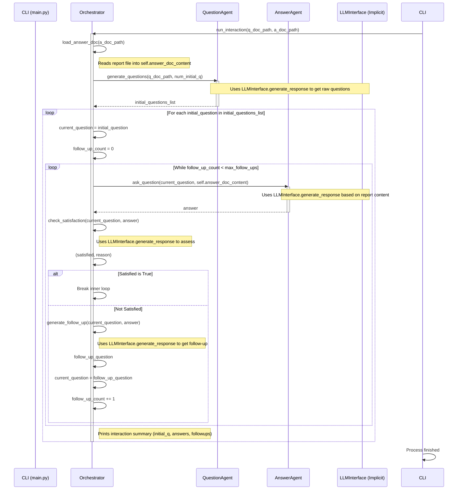

# Agent Interaction Flow (CLI Orchestrate Command)

This diagram illustrates the interaction flow between the CLI, Orchestrator, Question Agent, and Answer Agent during the `orchestrate` command execution. It focuses on the key function calls and data flow based on the implementation.

**Explanation of the Flow:**

1.  **Initialization:** The CLI calls the Orchestrator's `run_interaction` method with the paths to the question document and the answer document (report file).
2.  **Load Report:** The Orchestrator first loads the content of the answer document using its `load_answer_doc` method.
3.  **Generate Initial Questions:** It then calls the `QuestionAgent.generate_questions` method, providing the path to the question document. The Question Agent uses the LLM Interface internally to generate a list of initial questions based on this document.
4.  **Outer Loop (Initial Questions):** The Orchestrator iterates through each `initial_question` received from the Question Agent.
5.  **Inner Loop (Interaction Cycle):** For each initial question, an inner loop begins:
    *   **Ask:** The Orchestrator calls the `AnswerAgent.ask_question`, providing the current question and the pre-loaded report content. The Answer Agent uses the LLM Interface internally to formulate an answer based *only* on the provided report content.
    *   **Check:** The Orchestrator receives the `answer` and calls its own `check_satisfaction` method. This method uses the LLM Interface to assess if the answer adequately addresses the question. It returns a `satisfied` status (True/False) and potentially a `reason`.
    *   **Follow-up (If Needed):**
        *   If `satisfied` is True, the inner loop breaks for this initial question.
        *   If `satisfied` is False and the maximum number of follow-ups hasn't been reached, the Orchestrator calls its `generate_follow_up` method. This uses the LLM Interface to generate a follow-up question based on the original question and the unsatisfactory answer. The `current_question` is updated to this new follow-up question, the follow-up counter increments, and the inner loop continues (asking the Answer Agent the follow-up question).
        *   If the maximum follow-ups are reached, the inner loop breaks even if the last answer wasn't satisfactory.
6.  **Summary & Next Question:** After the inner loop finishes for an initial question (either satisfied or max follow-ups reached), the Orchestrator prints a summary of that interaction thread and proceeds to the next initial question in the outer loop.
7.  **Completion:** Once all initial questions have been processed, the `run_interaction` method finishes, and control returns to the CLI. 